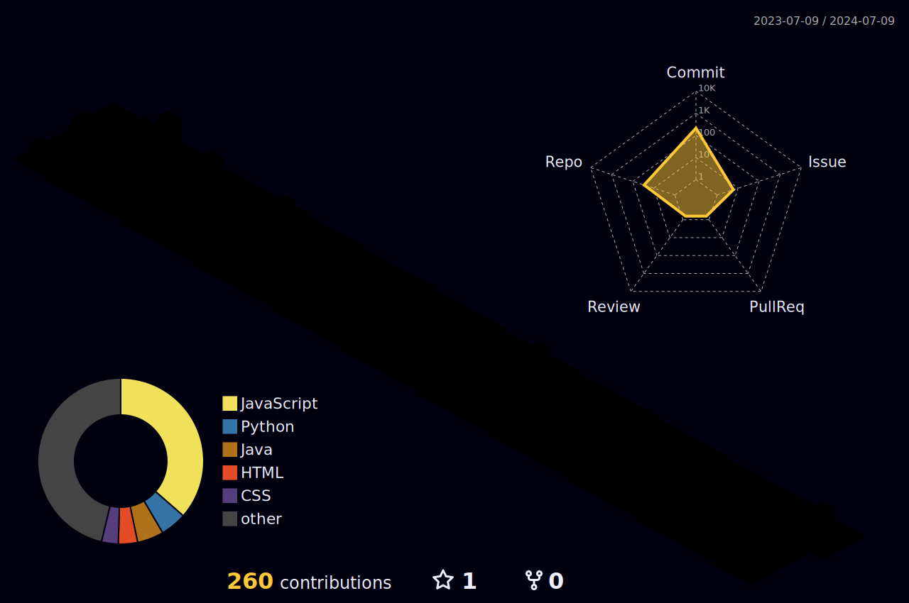

<!-- "Hero" Header -->

  
   
   
  
   
   

<table width="100%" align="center">
<tr>
<td align="center">
<a href="https://erdemonal.vercel.app/">

Visit my personal website 

</a>

</td>

</tr>
</table>

  
  
  
  
  
  
  
  
  
  
  

 

   

        
   
  <ul style="list-style-type: disc; text-align: left; margin-left: auto; margin-right: auto; width: fit-content;">
        <li><a href="https://text-to-image-wheat.vercel.app">Text to Image AI</a></li>
        <li><a href="https://type-blitz-silk.vercel.app">Typing Speed Game</a></li>
        <li><a href="https://budget-one-silk.vercel.app">Budget Tracking App</a></li>
        <li><a href="https://spotifysearch.vercel.app">Spotify Album Search</a></li>
        <li><a href="https://quiz-one-amber.vercel.app">Quiz App</a></li>
        <li><a href="https://leafletmap.vercel.app">Map App</a></li>
        <li><a href="https://starwarshex.vercel.app">Advanced Star Wars Movie App</a></li>
        <li><a href="https://taskfront-ten.vercel.app">Front-End Starters' Website</a></li>
        <li><a href="https://pomodoro-tau-seven.vercel.app">Pomodoro Timer</a></li>
        <li><a href="https://qrbeta.vercel.app">QR Generator and Scanner App</a></li>
        <li><a href="https://passwordgenerator-sable-two.vercel.app">Password Generator & Tester</a></li>
        <li><a href="https://mp3converter-xi.vercel.app">YouTube to MP3 Converter</a></li>
        <li><a href="https://bmicalculator-mauve.vercel.app">BMI Calculator</a></li>
    </ul>
    

    

    

    

